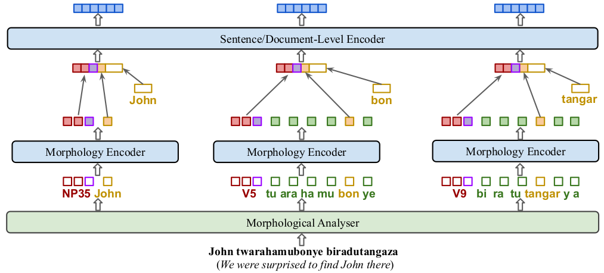

# KinyaBERT: a Morphology-aware Kinyarwanda Language Model

Implementation for the ACL 2022 paper [KinyaBERT: a Morphology-aware Kinyarwanda Language Model](https://arxiv.org/abs/2203.08459). 

<p align="center">

</p>

### News (2023)
- a pre-trained KinyaBERT model and the morphological analyzer have been released under a new repository: https://github.com/anzeyimana/DeepKIN

## Brief Introduction

KinyaBERT implements a two-tier BERT architecture for modeling morphologically rich languages (MRLs).
The current implementation is tailored to Kinyarwanda, a language spoken by more than 12M people in Central and Eastern Africa.
Due to the complex morphology expressed by MRLs such as Kinyarwanda, conventional tokenization algorithms such as byte pair encoding (BPE) are suboptimal at handling MRLs.
KinyaBERT leverages a morphological analyzer to extract morphemes and incorporates them in a two-tier transformer encoder architecture to explicitly express morphological compositionality.
Empirical experiments indicate that KinyaBERT outperforms baseline BERT models on natural language inference (NLI) and named entity recognition (NER) tasks.

## Repository guide:
- [`code`](code): main python codebase
- [`conf`](conf): vocabulary files for KinyaBERT
- [`datasets`](datasets): evaluation datasets for Translated GLUE benchmark, Named Entity Recognition (NER) and NEWS categorization tasks.
- [`fairseq-tupe-tpu-pytorch-v1.9`](fairseq-tupe-tpu-pytorch-v1.9): TPU-optimized [fairseq](https://github.com/facebookresearch/fairseq) code for baseline models. The package has been customized to use [TUPE-R](https://arxiv.org/abs/2006.15595) positional encoding
- [`lib`](lib): shared library for Kinyarwanda morphological analysis and part-of-speech tagging
- [`results`](results): Fine-tuning results in raw format
- [`scripts`](scripts): data pre-processing scripts

## Important files:
1. [`code/morpho_model.py`](code/morpho_model.py) : KinyaBERT model implementation in PyTorch
2. [`code/kinlpmorpho.py`](code/kinlpmorpho.py) : CFFI interface to the morphological analyzer
3. [`code/morpho_data_loaders.py`](code/morpho_data_loaders.py) : Data loading utilities
4. [`code/train_exploratory_distributed_model.py`](code/train_exploratory_distributed_model.py) : KinyaBERT pre-training process
5. [`code/pretrained_kinyabert_model_fine_tune_eval.py`](code/pretrained_kinyabert_model_fine_tune_eval.py) : KinyaBERT fine-tuning process
6. [`code/pretrained_roberta_model_fine_tune_eval.py`](code/pretrained_roberta_model_fine_tune_eval.py) : Baseline models fine-tuning process
7. [`lib/libkinlp.so`](lib/libkinlp.so) : Morphological analyzer/POS Tagger shared library
8. [`results/FINAL_AVERAGED_RESULTS.xlsx`](results/FINAL_AVERAGED_RESULTS.xlsx) : All experimental results aggregated in a spreadsheet

## Dependencies
- PyTorch version >= 1.8.0
- Python version >= 3.6
- NVIDIA [apex](https://github.com/NVIDIA/apex) for faster GPU training
- Progressbar2: ``pip install progressbar2``
- CFFI: ``pip install cffi``
- YouTokenMe: ``pip install youtokentome``

## How to use the code

The code in this repository is meant to be used for adapting KinyaBERT architecture to other languages and modeling scenarios.
This experimental code is not intended to be used straight out of the repository, but to provide a guidance to custom implementation.

### The morphological analyzer

The code in this repository requires having access to a morphological analyzer and the code itself cannot work without an adaptation to the morphological analyzer.
The adaptation can me made following the CFFI interface in [code/kinlpmorpho.py](code/kinlpmorpho.py) and making other necessary adjustments related to vocabularies.
The morphological analyzer for Kinyarwanda which is used in this work is a closed-source proprietary software.
The current plan is to make it available to researchers in a software-as-a-service model.
Currently, it can be provided by contacting the first author by E-mail ([anthonzeyi@gmail.com](mailto:anthonzeyi@gmail.com)).

## Citation

Please cite as:
```
@inproceedings{nzeyimana-niyongabo-rubungo-2022-kinyabert,
    title = "{K}inya{BERT}: a Morphology-aware {K}inyarwanda Language Model",
    author = "Nzeyimana, Antoine  and
      Niyongabo Rubungo, Andre",
    booktitle = "Proceedings of the 60th Annual Meeting of the Association for Computational Linguistics (Volume 1: Long Papers)",
    month = may,
    year = "2022",
    address = "Dublin, Ireland",
    publisher = "Association for Computational Linguistics",
    url = "https://aclanthology.org/2022.acl-long.367",
    pages = "5347--5363",
}
```
